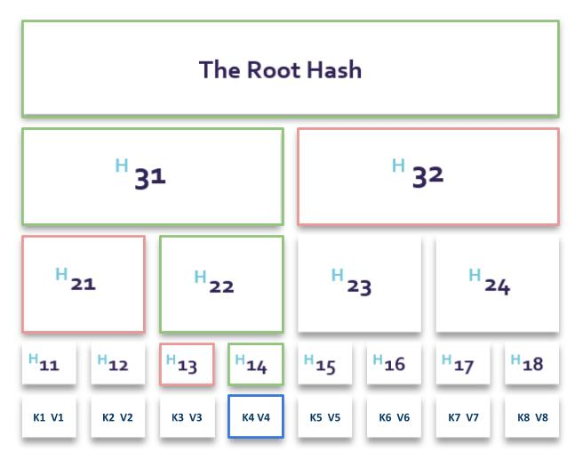

# Umbrella

All oracle data in Umbrella are merkelized. 
That means we can prove them at any point and in any time.

## How we merklelizing data - theory



Above picture represents merklee tree with 8 leaves (Kn, Vn). 
Leaves can be any data, in our case a pair of key and value. 
Each leave data (combined key + value) is hashed and as a result we got a unique ID hash (eg. H11). 
Uniqueness is being guaranteed by hashing algorithm. That means, if we made any change to data we will get a completely different hash. 

All data hashes creates next level of tree - leaf hashes (H11-18). 
Joining them into pairs and hashing them produces yet another tree level. 
Root is being calculated by repeating above unil we left with just one hash. 
Because of the uniqueness of hashes, different data produces different roots. 
We are using this property to prove the data. 

### How to prove tha data is valid - theory

In order to proof that `K4,V4` are valid this is what needs to be done:
1. knowing the K4 and V4, calculate H14
1. in order to calculate hash H22, sibling of H14 that is H13 needs to be known, and it is provided by Umbrella
1. having H13 and H14 calculate H22
1. repeat hashing with siblings until root will be known
1. if calculated root is the same merkle tree root for all the data, that means `K4,V4` is a valid pair.


if the root that we got is the same as saved on-chain we just proved that TX4 data is valid.
Set of siblings (marked in red) are delivered by Umbrella via layer2 API. Using K,V data and siblings our smart contract can calculate the root (path to generate root is marked in green) and compare it to the root that was saved. That way our smart contract can verify the data.


## Requesting data

Roots are stored on blockchain (Layer 1) in smart contract. Each root represents set of key-value pairs for given time.

Merkle tree data are stored in Layer 2 and are availabe via API.

To get a price of asset and be able to prove that the procee is valid we need to execute this steps:

- make a call to API and request data and proof for selected key(s)
- send result to your smart contract
- your smart contract makes request to Umbrella oracle smart contract and validating the data
- when data valid, perform operation based on validated data

### Request data from API 

_**developer note: idealy we could use https://swagger.io/ for API docs**_

API is available via GET calls.

#### Key-Value request 

To get price of `eth-eur` made a call:

```
# call for one key
/proofs/?keys[]=eth-eur

# call for multtiple keys 
/proofs/?keys[]=eth-eur&keys[]=eth-usd 
``` 

Response example:

```json
{
  "data": {
    "block": {
      "staked": 1000000000000000000,
      "power": 1000000000000000000,
      "voters": [
        "0xdCF58cc8d72ccdAcB34ddC6BC7664388643ae6E9"
      ],
      "votes": {},
      "_id": "block::3696396",
      "height": 3696396,
      "__v": 1,
      "anchor": 22178376,
      "timestamp": "2020-11-19T11:28:20.000Z",
      "status": "finalized",
      "minter": "0xdCF58cc8d72ccdAcB34ddC6BC7664388643ae6E9",
      "root": "0xc0f5825dc05e673ffcb59d46b8853f69a6b369ea37f097e44aa27094fae53ef2"
    },
    "keys": [
      "eth-eur"
    ],
    "leaves": [
      {
        "proof": [
          "0xca7c4a82a76440f5d3a6567f182722c6e39afcb0403b71da7e7fdfdd232d65af"
        ],
        "_id": "leaf::block::3696396::eth-eur",
        "blockId": "block::3696396",
        "key": "eth-eur",
        "__v": 0,
        "value": "398.23"
      }
    ]
  }
}
```

```javascript
// raw value
const value = response['data']['leaves']['value']

// data needed for blockchain validation
const valueAsBytes = response['data']['leaves']['valueBytes']
const keyAdBytes = response['data']['leaves']['keyBytes']
const proof = response['data']['leaves']['proof']
const blockHeight = response['data']['block']['height']
```

### Validation on-chain

Having all necessary data from API send them o your contract and let him made a call to Umbrella oracle smart contract.

This could look like this:

```solidity
pragma solidity ^0.6.8;

import "./interfaces/IUmbrellaOracle.sol";

contract YourSmartContract  {
  IUmbrellaOracle umbrella = IUmbrellaOracle(0xE9774661dBDd82ad2D7d6dae6474e62136926ef8);

  function umbrellaValidation(
    uint256 _blockHeight,
    bytes32[] memory _proof,
    bytes memory _key,
    bytes memory _value
  ) public view {
    bool valid = umbrella.verifyProofForBlock(_blockHeight, _proof, _key, _value);
    require(valid, "data can't be verified");
    
    // do stuff here ...
  }
}
```

## Smart contract Addresses

- Kovan: [0xE9774661dBDd82ad2D7d6dae6474e62136926ef8](https://kovan.etherscan.io/address/0xE9774661dBDd82ad2D7d6dae6474e62136926ef8)
